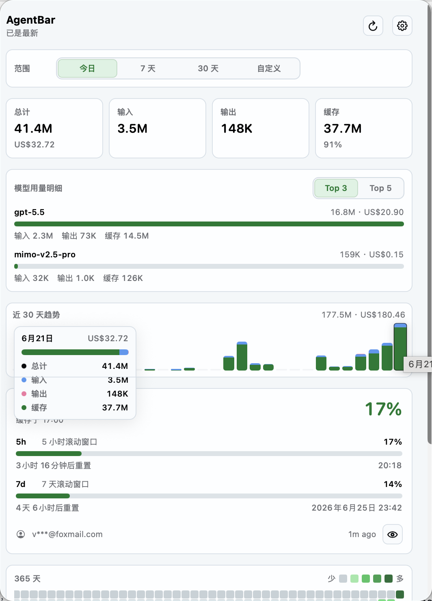

<p align="center">
  
</p>

<h1 align="center">AgentBar</h1>

<p align="center">
  <a href="README.zh-CN.md">中文</a>
</p>

AgentBar is a local-first macOS menu bar app for tracking AI coding assistant usage. It scans usage records on your Mac, estimates token and cost totals, and shows local usage plus Codex quota progress directly in the menu bar.



## Why AgentBar

- See today's, 7-day, and all-time AI coding usage without opening a dashboard.
- Track Codex 5-hour and 7-day quota windows from the menu bar.
- Estimate costs from local token records and configurable budgets.
- Keep usage data local. AgentBar stores normalized records in a SQLite database on your Mac.
- Install with Homebrew, download a release build, or build from source.

## Install

### Homebrew

```bash
brew tap varenyzc1/agentbar
brew install --cask agentbar
```

To upgrade:

```bash
brew update && brew upgrade --cask agentbar
```

AgentBar can detect Homebrew installs and open a Terminal-based Homebrew update flow from the Settings window when a newer release is available.

### GitHub Release

1. Open the repository's **Releases** page.
2. Download `AgentBar-macos.zip` from the latest release.
3. Unzip it and move `AgentBar.app` to `/Applications`.
4. Launch AgentBar.

If macOS says the app is damaged or Settings does not open, remove the quarantine flag and launch it again:

```bash
xattr -cr /Applications/AgentBar.app
```

### Build from Source

Requirements:

- macOS 14 or later
- Xcode Command Line Tools
- Swift 5.9 or later

```bash
git clone https://github.com/varenyzc1/agentbar.git
cd agentbar
./build.sh
open .build/AgentBar.app
```

## Features


- Menu bar display modes for quota, alerts, or local usage.
- Codex quota indicators for 5-hour and 7-day rolling windows.
- Local usage summaries for today, 7 days, and all time.
- Subtle sparkline backgrounds on summary cards to show usage trends over time.
- Source breakdowns for tools such as Codex and Claude Code.
- 365-day activity heatmap with a GitHub-style staggered opening animation.
- English and Simplified Chinese interface switching from Settings.
- Pricing-based cost estimates and budget settings.
- Manual scan, cost recalculation, pricing reset, and launch-at-login controls.
- Version display and update checks against GitHub Releases.

## Settings

The Settings window lets you configure menu bar display, language, refresh behavior, launch at login, token and cost budgets, maintenance actions, and updates.


## How It Works

AgentBar reads local usage files produced by supported coding assistants, parses provider, model, token, and timestamp information, and stores normalized records in a local SQLite database. The app aggregates those records into summary ranges and rolling windows, applies a pricing catalog for cost estimates, and renders the result in a lightweight SwiftUI menu bar interface.

Quota information is separate from local usage totals. When available, AgentBar refreshes quota state over the network and caches it locally so the menu bar remains useful between refreshes.

## Privacy

AgentBar is designed around local scanning and local storage. It does not need a server to calculate local usage summaries.

Network access is used for:

- Codex quota refreshes, when configured.
- GitHub release checks for updates.
- Homebrew updates, when you choose to update a Homebrew-installed app.

Be careful when sharing screenshots because account names, usage totals, quota timing, and local paths may be visible.

## Development

Run tests:

```bash
swift test
```

Run a local debug build:

```bash
./debug.sh
```

Build the release app bundle:

```bash
./build.sh
```

Repository layout:

```text
.
├── Package.swift                  Swift package manifest
├── build.sh                       Local release app bundle shortcut
├── debug.sh                       Local debug launcher
├── release.sh                     Creates and pushes a version tag for CI
├── LICENSE
├── README.md
├── README.zh-CN.md
├── .github/
│   └── workflows/
│       └── release.yml            CI, release packaging, Homebrew cask update
├── Scripts/
│   └── build_app.sh               App bundle builder used locally and by CI
├── Sources/
│   ├── AgentBar/                  SwiftUI app, menu bar UI, settings, updates
│   └── AgentBarCore/              scanning, parsing, storage, pricing, aggregation
├── Tests/
│   └── AgentBarCoreTests/         core behavior tests
└── docs/
    └── assets/                    README screenshots
```

## Release Process

Releases are built by GitHub Actions when a `v*` tag is pushed. CI runs tests, builds the app bundle, uploads `AgentBar-macos.zip` and `AgentBar-macos.dmg` to GitHub Releases, and updates the Homebrew cask when `TAP_PAT` is configured.

### Daily Development

1. Make your changes and commit:

   ```bash
   git add .
   git commit -m "Your commit message"
   git push
   ```

   Or use the VSCode source control panel: stage changes (⊕), type a commit message, commit (✔), and sync (⇄).

2. Run tests before committing:

   ```bash
   swift test
   ```

3. Test locally with a debug build:

   ```bash
   ./debug.sh
   ```

### Publishing a New Release

Releases are automatic after app or package changes are merged to `main`.

1. Before merging, run tests:

   ```bash
   swift test
   ```

2. Merge the pull request to `main`.

   The `Auto Release` workflow checks whether the merge changed `Sources/` or `Package.swift`. If so, it creates the next `vX.Y.Z` tag and starts the release workflow. Version bumps are inferred from commit messages since the latest release tag:

   - `BREAKING CHANGE:` or a `!` marker, such as `feat!:`, bumps the major version.
   - `feat:` bumps the minor version.
   - Everything else bumps the patch version.

   Add `[skip release]` or `[no release]` to the merge commit message to skip automatic release creation.

3. CI automatically:

   - Runs the test suite
   - Builds the `.app` bundle
   - Packages `AgentBar-macos.zip` and `AgentBar-macos.dmg`
   - Publishes a GitHub Release with both files attached
   - Updates the Homebrew cask (if `TAP_PAT` secret is configured)

4. Monitor the build at **Actions** on the GitHub repository page. Once complete, the release with downloadable assets appears at **Releases**.

To publish manually, create and push a version tag:

```bash
./release.sh 0.2.0
```

This creates a `v0.2.0` tag and pushes it to GitHub, which starts the same release workflow.

## Contributing

Issues and pull requests are welcome. Before opening a PR, please run:

```bash
swift test
./build.sh
```

For UI changes, include a screenshot or short note describing what changed in the menu bar panel or Settings window.

## Credits

- [varenyzc](https://github.com/varenyzc1/agentbar)
- [ZengWenJian123](https://github.com/ZengWenJian123)

## License

Apache License 2.0. See [LICENSE](LICENSE).
