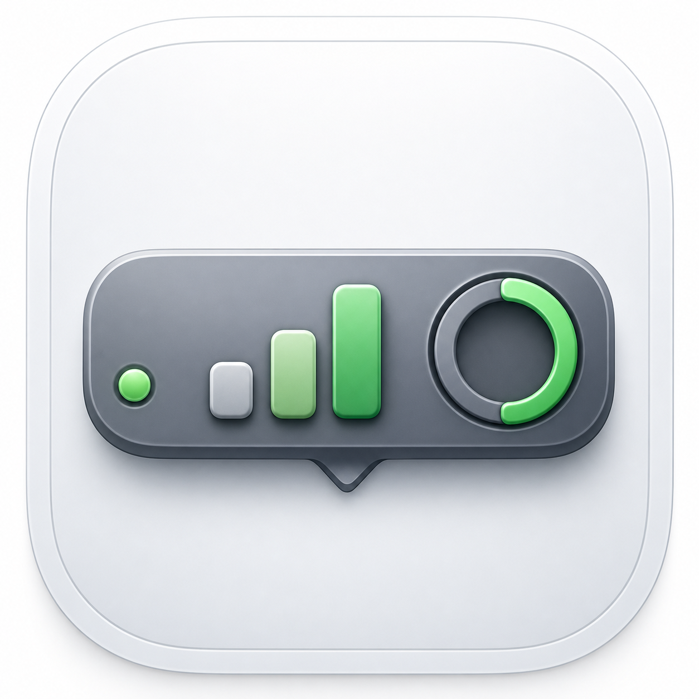
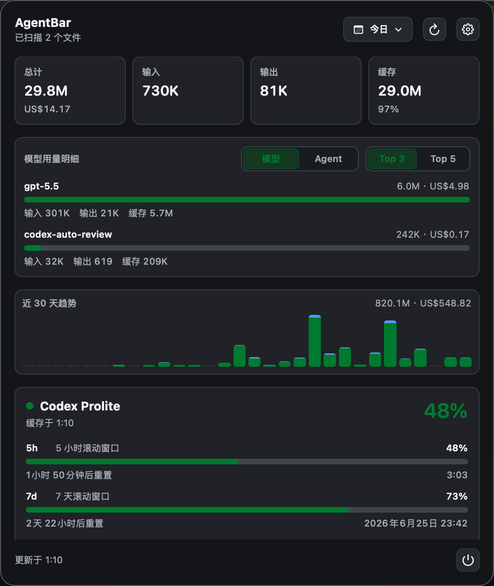
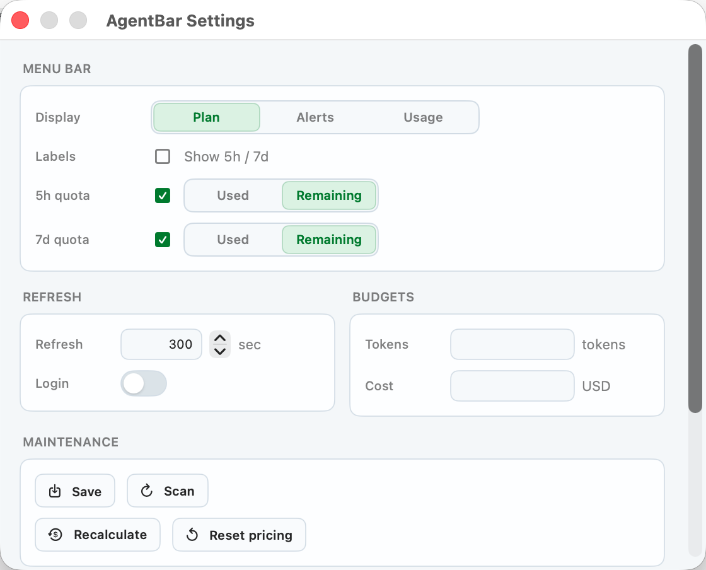

<p align="center">
  
</p>

<h1 align="center">AgentBar</h1>

<p align="center">
  <a href="README.md">English</a>
</p>

AgentBar 是一个本地优先的 macOS 菜单栏应用，用来查看 AI 编程助手的使用量。它会扫描你 Mac 上的本地使用记录，估算 token 和费用，并把本地使用量与 Codex 配额进度显示在菜单栏里。



## 为什么用 AgentBar

- 不打开网页，也能看到今日、近 7 天和全部 AI 编程使用量。
- 在菜单栏追踪 Codex 5 小时和 7 天滚动配额窗口。
- 基于本地 token 记录估算费用，并支持配置预算。
- 数据本地优先。AgentBar 会把归一化后的记录存到你 Mac 上的 SQLite 数据库。
- 支持 Homebrew 安装、下载 Release 包，或从源码构建。

## 安装

### Homebrew

```bash
brew tap varenyzc1/agentbar
brew install --cask agentbar
```

升级到最新版本：

```bash
brew update && brew upgrade --cask agentbar
```

AgentBar 可以识别 Homebrew 安装方式。检查到新版本时，设置页可以打开一个基于 Terminal 的 Homebrew 更新流程。

### GitHub Release

1. 打开项目的 **Releases** 页面。
2. 下载最新版本里的 `AgentBar-macos.zip`。
3. 解压后把 `AgentBar.app` 移到 `/Applications`。
4. 启动 AgentBar。

如果 macOS 提示应用已损坏，或设置窗口无法打开，可以移除隔离标记后重新启动：

```bash
xattr -cr /Applications/AgentBar.app
```

### 从源码构建

环境要求：

- macOS 14 或更新版本
- Xcode Command Line Tools
- Swift 5.9 或更新版本

```bash
git clone https://github.com/varenyzc1/agentbar.git
cd agentbar
./build.sh
open .build/AgentBar.app
```

## 功能


- 支持配额、提醒、本地使用量等菜单栏显示模式。
- 显示 Codex 5 小时和 7 天滚动窗口配额。
- 汇总今日、近 7 天和全部使用量。
- 在用量摘要卡片底层显示折线趋势，用来观察时间和用量变化。
- 按来源展示使用量，例如 Codex、Claude Code。
- 365 天活动热力图，并带有 GitHub 风格的错峰打开动画。
- 可在设置页切换英文和简体中文界面。
- 基于价格表估算费用，并支持预算设置。
- 支持手动扫描、费用重算、价格重置和开机启动。
- 显示当前版本，并可检查 GitHub Releases 中的新版本。

## 设置

设置页可以配置菜单栏显示内容、界面语言、刷新行为、开机启动、token 与费用预算、维护操作和更新检查。



## 工作原理

AgentBar 会读取支持的编程助手在本地生成的使用记录，从中解析 provider、model、token 和时间信息，然后把归一化后的记录写入本地 SQLite 数据库。应用基于这些记录计算汇总区间和滚动窗口，再结合模型价格表估算费用，最后通过轻量的 SwiftUI 菜单栏界面展示。

配额信息和本地使用量是分开的。可用时，AgentBar 会通过网络刷新配额状态并缓存在本地，这样菜单栏在两次刷新之间也能保持可用。

## 隐私

AgentBar 以本地扫描和本地存储为基础，不需要服务器来计算本地使用量。

会用到网络的场景包括：

- 配置后刷新 Codex 配额。
- 检查 GitHub Releases 中的新版本。
- 当你选择更新 Homebrew 安装的应用时，执行 Homebrew 更新。

分享截图时请注意，账号、使用量、配额时间和本地路径可能会出现在界面中。

## 开发

运行测试：

```bash
swift test
```

运行本地调试版本：

```bash
./debug.sh
```

构建 release app bundle：

```bash
./build.sh
```

仓库结构：

```text
.
├── Package.swift                  Swift package manifest
├── build.sh                       本地 release app bundle 快捷入口
├── debug.sh                       本地调试启动脚本
├── release.sh                     创建并推送版本 tag，触发 CI
├── LICENSE
├── README.md
├── README.zh-CN.md
├── .github/
│   └── workflows/
│       └── release.yml            CI、release 打包、Homebrew cask 更新
├── Scripts/
│   └── build_app.sh               本地和 CI 共用的 app bundle 构建脚本
├── Sources/
│   ├── AgentBar/                  SwiftUI 应用、菜单栏界面、设置、更新
│   └── AgentBarCore/              扫描、解析、存储、价格、聚合逻辑
├── Tests/
│   └── AgentBarCoreTests/         核心逻辑测试
└── docs/
    └── assets/                    README 截图
```

## 发布流程

影响 app 或 package 的改动合并到 `main` 后会自动发布。`Auto Release` workflow 会创建下一个 `vX.Y.Z` tag，并启动 release workflow。CI 会运行测试、构建 app bundle、上传 `AgentBar-macos.zip` 和 `AgentBar-macos.dmg` 到 GitHub Releases，并在配置 `TAP_PAT` 后更新 Homebrew cask。

### 日常开发

1. 修改代码后提交并推送：

   ```bash
   git add .
   git commit -m "你的提交信息"
   git push
   ```

   也可以在 VSCode 源代码管理面板操作：暂存更改（⊕）、输入提交信息、提交（✔）、同步（⇄）。

2. 提交前建议先跑测试：

   ```bash
   swift test
   ```

3. 本地调试运行：

   ```bash
   ./debug.sh
   ```

### 发布新版本

1. 合并前运行测试：

   ```bash
   swift test
   ```

2. 将 pull request 合并到 `main`。

   `Auto Release` workflow 会先检查这次合并是否改动了 `Sources/` 或 `Package.swift`。若有相关改动，它会根据最近一个 release tag 之后的提交信息推断版本升级方式：

   - `BREAKING CHANGE:` 或 `feat!:` 这类 `!` 标记会升级 major 版本。
   - `feat:` 会升级 minor 版本。
   - 其他提交默认升级 patch 版本。

   如果要跳过自动发布，在 merge commit 信息里加入 `[skip release]` 或 `[no release]`。

3. CI 自动完成：

   - 运行测试
   - 构建 `.app` bundle
   - 打包 `AgentBar-macos.zip` 和 `AgentBar-macos.dmg`
   - 创建 GitHub Release 并上传产物
   - 更新 Homebrew cask（需配置 `TAP_PAT` secret）

4. 在 GitHub 仓库页面的 **Actions** 查看构建进度。构建完成后，**Releases** 页面会出现可下载的 dmg 和 zip 文件。

如需手动发布，可以创建并推送版本 tag：

```bash
./release.sh 0.2.0
```

这会创建 `v0.2.0` tag 并推送到 GitHub，然后启动同一个 release workflow。

## 参与贡献

欢迎提交 issue 和 pull request。提交 PR 前建议运行：

```bash
swift test
./build.sh
```

如果改动涉及界面，请在 PR 中附上截图，或简单说明菜单栏面板/设置页发生了哪些变化。

## 致谢

- [varenyzc](https://github.com/varenyzc1/agentbar)
- [ZengWenJian123](https://github.com/ZengWenJian123)

## License

Apache License 2.0。详见 [LICENSE](LICENSE)。
